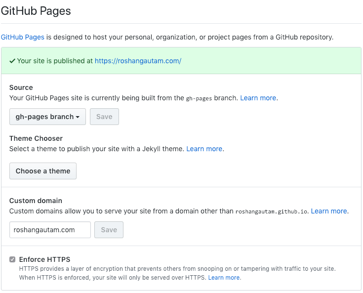

<p style="text-align: center;">
  <image src="./personal-websites-101.svg"/>
</p>

In this article we will explore a set of tools and services which will let you build a personal static site super fast and with almost zero cost. All you will need is 30 mins tops to get up and running excluding the time required to create your content.

To build a personal static website you need

- A server to host your static site,
- A platform to create your static content.

## Getting Started

### [Github](https://github.com)

We will use github pages to host our static site. If you own a personal domain, you can configure github pages to use
your custom domain at no cost. Isn't that wonderful.

> If you don't have a github account, please visit [Github](https://github.com) and signup for a free account.

### [Jigsaw](http://jigsaw.tighten.co)

Jigsaw is a wonderful static site generator built using components from [Laravel](https://laravel.com/),
[Symfony](https://symfony.com/) and [Tailwind CSS](https://tailwindcss.com/). The best part is you can create your
content using `markdown` and its supports `svg` out of the box.

> There are a plethora of static site generators available online. You can use any of them. For this article we are
> using Jigsaw.

Let's walk through the steps required to get you up and running.

#### Install required tools

Install the following tools. Skip this step if you already have'em

- [Composer](https://getcomposer.org)
- [NodeJS](https://nodejs.org)
- [hub](https://hub.github.com/) - Optional, used to maintain github account from a command line

> macOS users can use [homebrew](https://brew.sh/) to easily install these tools. Likewise, you can use
> [chocolatey](https://chocolatey.org/) in Windows and yum/apt in red hat or debian based linux distros.

#### Project Setup

Let's create a new github repository. You can either visit [Github](https://github.com) or use
[hub](https://hub.github.com/) from your command line to create your new repository. Matter of fact this very site is
hosted in github pages. You can find the repository [here](https://github.com/roshangautam/roshangautam). Once you are
done creating the repository, fire up your favorite terminal and execute the following commands

Create a project directory

```sbtshell
mkdir your-awesome-site && cd your-awesome-site
```

Initialize a git repository

```sbtshell
git init
```

Add remote origin to your project

```sbtshell
git remote add origin git@github.com:username/repository.git
```

> Replace username with your github username and repository with the name of newly created github repository.

#### Create your static site

Let's create your static site. Make sure you are in your project directory created above ^

Install Jigsaw to project

```sbtshell
composer require tightenco/jigsaw
```

> Make sure ~/.composer/vendor/bin is in your $PATH.

Initialize Jigsaw with blog template

```sbtshell
./vendor/bin/jigsaw init blog
```

> FYI: Jigsaw also provides a docs template

Customize your site. For more details on customizing your site content please visit Jigsaw's
[online documentation](https://jigsaw.tighten.co/docs/installation/)

Once you are done customizing your site content

Prepare all files to be committed to your github repository

```sbtshell
git add .
```

Create a commit

```sbtshell
git commit -m "Initial Commit"
```

Push your changes to github

```sbtshell
git push --set-upstream origin master
```

#### Build & Deploy

Once you are comfortable with the content of your site. Execute the following commands to build your site and deploy it
to `github-pages` branch of your repository

Build your static site

```sbtshell
./vendor/bin/jigsaw build production
```

> This will generate your static site in a temporary directory called `build_production`.

Next, let's setup a worktree to push `build_production` to `gh-pages` branch of your github repo

```sbtshell
$ git worktree add build_production gh-pages
```

Push/deploy `build_production` to `github-pages` branch of your repository

```sbtshell
$ cd build_production && git add . && git commit -m "Deploy" && git push origin gh-pages --force
```

As soon as your commit goes through, your site should be live at http://username.github.io/repository. Voila !!!

#### Custom domains

This all sounds good but what about custom domains. If you own a custom domain and point it to github pages

- Visit your github repository settings and add your custom domain to github pages settings as shown below



- Visit your domain registrars website and add one of these as an `A` record to your domain's DNS settins

```sbtshell
185.199.108.153
185.199.109.153
185.199.110.153
185.199.111.153
```

> You just need one of the entries to work. Depdending on how long does your DNS provider takes time to propagate the
> changes, your domain should start pointing at your github pages repo within a few minutes to a couple of hours.

**_Thats it folks !!!_**
